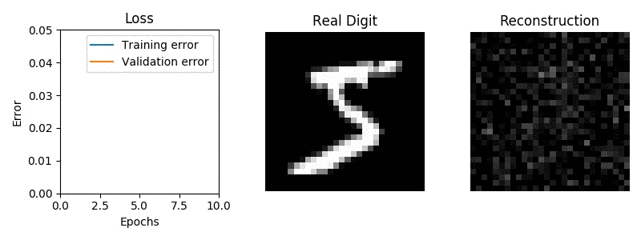

# NumpyNet
Numpy implementation of simple autoencoder neural network including backpropagation and momentum. Not optimized for performance, but simplicity of code, mainly used for educational purposes. The training error is computed accumulatively during each epoch and will thus typically be larger than validation error in early epochs where model changes a lot during each epoch (this is consistent with e.g. keras). 

